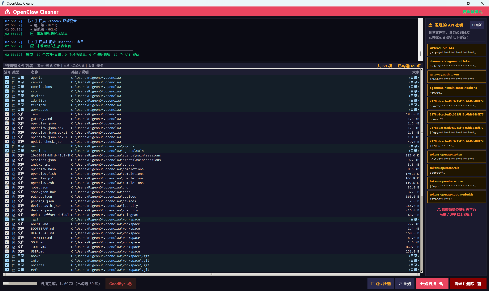

# OpenClaw Cleaner / ClawCleaner



**English** | [中文](#中文)

---

## English

A cross-platform (macOS & Windows) utility that safely removes all traces of the OpenClaw / Claude Code application from your system — including local files, environment variables, registry entries (Windows), and exposed API keys.

### Features & Logic

- **Cross-Platform Support**: Dedicated apps for both macOS and Windows with native GUI.
- **File & Directory Scan**: Finds OpenClaw-related files across AppData, LocalAppData, Desktop, Temp folders (Windows) and `~/.claude`, `~/Library/Application Support/OpenClaw`, `~/openclaw` (macOS).
- **Environment Variable Cleanup**: Detects and removes OpenClaw entries from Windows environment variables and macOS shell profiles (`.zshrc`, `.bashrc`, etc.).
- **Registry Cleanup (Windows)**: Scans Uninstall entries in HKCU and HKLM for OpenClaw remnants.
- **API Key Detection**: Identifies exposed API keys (OpenAI, Anthropic, Gemini, Groq, etc.) in config files via regex and warns you to revoke them before deletion.
- **Selective Cleanup**: Check/uncheck individual items before deleting; preview file contents before acting.
- **Permissions**: Prompts for Administrator/Root privileges to handle system-level entries.

### Quick Start

#### macOS
1. Download `OpenClaw_Cleaner.app` or the executable for macOS.
2. Double-click to run. You may be prompted for Administrator privileges for a thorough cleanup.
3. Review the scanned remnants and click to clean.

#### Windows
1. Download `OpenClaw Cleaner` executable.
2. Double-click to run (click **Yes** on the UAC prompt for full cleanup capability).
3. Review the found items and click to clean.

### Build from Source

#### Prerequisites
- Python 3.10+
- `pip install pyinstaller`

#### macOS
```bash
cd MacOS
chmod +x build_mac.sh
./build_mac.sh
```
The compiled application will be generated via PyInstaller, resulting in an `OpenClaw_Cleaner.app` bundle in `MacOS/dist/` or `MacOS/build/`.

#### Windows
```cmd
cd Windows
build.bat
```
The compiled executable will be built and placed in the appropriate `dist` output directory.

### Project Structure
```text
ClawCleaner/
├── README.md                 
├── MacOS/
│   ├── mac_cleaner.py        # macOS main application source
│   ├── build_mac.sh          # macOS PyInstaller build script
│   └── OpenClaw_Cleaner.spec # PyInstaller spec file
└── Windows/
    ├── cleaner.py            # Windows main application source
    ├── build.bat             # Windows PyInstaller build script
    ├── make_icon.py          # Icon generator utility
    └── fix.py                # Helper script
```

---

## 中文

<a name="中文"></a>

一款跨平台（macOS 和 Windows）的清理工具，用于安全地彻底移除系统中所有与 OpenClaw / Claude Code 相关的残留文件、环境变量、注册表项（仅 Windows）以及暴露的 API 密钥。

### 功能与处理逻辑

- **跨平台支持**：提供 macOS 和 Windows 各自独立的原生图形界面程序（分别使用各自的原生库并适配高 DPI 等）。
- **文件与目录扫描**：在系统的各个常见角落（如 Windows 的 AppData、Temp；macOS 的 `~/.claude`、`~/Library` 等）寻找 OpenClaw 相关的目录和缓存文件。
- **环境变量清理**：检测并清除 Windows 的系统/用户环境变量，以及 macOS 的 Shell 配置文件（如 `.zshrc`, `.bashrc`）。
- **注册表清理（仅限 Windows 版）**：扫描并移除 Windows 注册表中卸载相关的 OpenClaw 遗留项。
- **API 密钥检测**：通过正则表达式分析扫描到的文件，精准识别并提取暴露的 API 密钥（如 OpenAI、Anthropic、Gemini 等），并在删除前提醒你前往对应平台注销以防泄露。
- **选择性清理**：删除前提供清晰的列表，可双击预览文件或自由勾选/取消勾选特定项。
- **权限提权自动管理**：工具启动时将自动请求以管理员/Root身份运行，确保能彻底清理系统层面的深层残留。

### 快速使用

#### macOS 系统
1. 下载 `OpenClaw_Cleaner.app` 打包程序。
2. 双击运行应用程序。根据提示，输入密码以允许其获得管理员（Root）权限进行深度清理。
3. 核对扫描出的文件、环境变量和密钥残留列表，点击“清理”。

#### Windows 系统
1. 下载 Windows 版的 `OpenClaw Cleaner` 可执行程序（`.exe`）。
2. 双击运行（在 UAC 用户账户控制弹窗中点击 **“是”** ，以获得完整清理权限）。
3. 检查并核对扫描列表，勾选需要删除的项后进行清理操作。

### 自行构建

#### 前置环境
- Python 3.10+
- `pip install pyinstaller`

#### macOS 构建
```bash
cd MacOS
chmod +x build_mac.sh
./build_mac.sh
```
编译完成后，会在构建目录中生成可直接运行的 `OpenClaw_Cleaner.app` 应用程序包。

#### Windows 构建
```cmd
cd Windows
build.bat
```
依赖安装并编译完成后，将生成独立的 `.exe` 可执行文件。

### 项目结构
```text
ClawCleaner/
├── README.md                 
├── MacOS/
│   ├── mac_cleaner.py        # macOS 核心清理逻辑源码
│   ├── build_mac.sh          # macOS 打包脚本
│   └── OpenClaw_Cleaner.spec # PyInstaller 配置文件
└── Windows/
    ├── cleaner.py            # Windows 核心清理逻辑源码
    ├── build.bat             # Windows 打包脚本
    ├── make_icon.py          # 图标生成工具
    └── fix.py                # 辅助脚本
```

---

> **⚠️ 重要提示 / Important**
> API keys found during scanning are **not** automatically revoked — you must manually invalidate them on the respective platform's dashboard before deleting the files. 
> 在扫描过程中发现的 API 密钥**不会**被自动注销。在删除这些文件之前，强烈建议您手动登录对应的大模型平台控制台将这些密钥作废，以免造成安全隐患。
